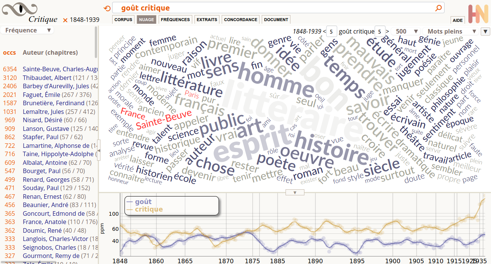

# Obvie

Obvie est une application web Java pour explorer des textes en XML/TEI,
basée sur le moteur d’indexation sur [Lucene java](https://lucene.apache.org/core/),
piloté par [Alix](https://github.com/oeuvres/Alix), pour la lemmatisation
et les statistiques lexicales.

## Dossiers

* web/ — [servlet standard] l’application web installable (java webapp)
  * WEB-INF — [servlet standard]
    * base1.xml — déclaration d’une base qui répondra à {servletContext}/base1/
    * base2.xml — déclaration d’une base qui répondra à {servletContext}/base2/
    * index.sh — script pour indexer une base
    * bases — [requis] dossier contenant la déclaration des bases et leur index lucene
    * web.xml — [servlet standard]
    * lib — [servlet standard] jars
    * classes — [servlet standard] classes compilées
    * ext — autres librairies (uniquement pour le développement)
  * static — ressources servies sans modification
    * vendor — librairies importées, à ne pas modifier
    * img — images
    * doc — aide
    * js — javascript de l’interface
  * jsp — pages dynamiques
* ext/ — librairies (jar) utiles à la compilation mais pas nécessaires à l’exécution
* java/ — classes java spécifiques à l’application Obvie
